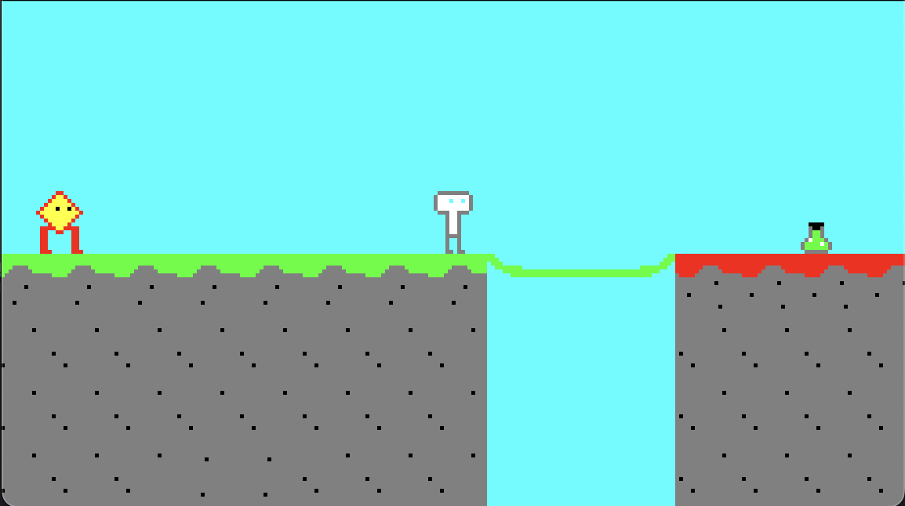

# Bitmap

2D game developed in Godot Engine.
Minimalist, in 8bit colors, with a retro style.

## Player

- Move with the arrow keys, or `WASD`.

## Items

- Green potion: Increase the speed of the player.
- Blue potion: Decrease the speed of the player.
- Torch: Increase the light of the player.

## Enemies

- Enemy: Can move, jump

## Screenshots

20 august 2024

## Usage

<!-- [Link of the game](https://lacunaire.itch.io/fuzeeng) -->
